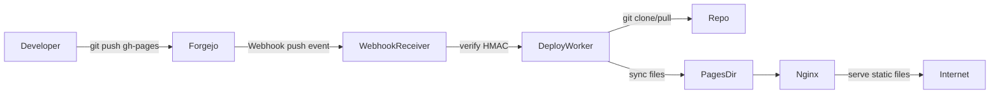

## Why This Was Needed ?

Because I use **Forgejo instead of GitHub**, but I still wanted the **GitHub Pages experience** — mainly to test UI builds and deploy static frontends easily.

GitHub provides a very convenient workflow:

1. Push a static site to `gh-pages`
2. GitHub automatically builds and hosts it
3. The site becomes available under a predictable domain

Forgejo doesn't provide this out of the box.

So I built **static-pages**, a lightweight service that:

- listens to Git **webhooks**
- detects pushes to a specific branch (default: `gh-pages`)
- pulls the repository
- deploys the static files
- serves them via **Nginx**

The result is essentially **GitHub Pages for a self-hosted Git server**.

---

## How It Works

The system is intentionally simple and runs in a **single container** containing:

- **Flask** → webhook receiver
- **Nginx** → static file server
- **supervisord** → process manager

When a repository pushes to the configured branch, the service deploys it automatically.

### Architecture Diagram


---

### Deployment Flow

1. A developer pushes to `gh-pages`
2. Forgejo sends a **webhook event**
3. The Flask service verifies the **HMAC signature**
4. The repository is **cloned or updated**
5. Static files are copied to:

```
/data/pages/<owner>/<repo>/
```

6. Nginx immediately serves the files.

Example URLs:

```
https://alice.pages.example.com/
https://alice.pages.example.com/blog/
```

---

---

## Features

### Automatic Deployments

Push to `gh-pages` → deploy instantly.

---

### Multi-Repository Support

Supports unlimited repositories.

```
/data/pages/
 ├── alice/
 │   ├── alice/        (root site)
 │   └── blog/
 └── bob/
     └── portfolio/
```

---

### Subdomain Routing

Owner sites:

```
https://alice.pages.example.com/
```

Repo sites:

```
https://alice.pages.example.com/blog/
```

---

### SPA Support

Supports Netlify-style `_redirects` files for:

- SPA fallbacks
- redirects
- routing

Example `_redirects`:

```
/old-page   /new-page   301
/*          /index.html 200
```

---

---

## Configuration

The service is configured entirely via **environment variables**.

| Variable | Description |
|--------|--------|
| `GIT_URL` | URL of your Forgejo/Gitea instance |
| `ADMIN_TOKEN` | Admin API token |
| `PAGES_DOMAIN` | Domain used for hosting pages |
| `PAGES_BRANCH` | Branch used for pages (default `gh-pages`) |

Example:

```bash
GIT_URL=http://git:3000
PAGES_DOMAIN=pages.example.com
ADMIN_TOKEN=xxxxx
PAGES_BRANCH=gh-pages
```

---

## Setup Steps

### 1. Run the Service

Start the container with the required environment variables.

Example Docker run:

```bash
docker run -d \
  -e GIT_URL=http://git:3000 \
  -e PAGES_DOMAIN=pages.example.com \
  -e ADMIN_TOKEN=xxxxx \
  -v pages_data:/data \
  favicon-pages
```

---

### 2. Register the System Webhook

When the service starts it prints instructions like:

```
WEBHOOK SETUP REQUIRED
Create a system-level webhook in Git with these settings:
```

Configure a **system webhook** in Forgejo:

```
Admin → System Hooks → Add Webhook
```

Settings:

```
Target URL    : http://pages-service:5000/webhook
HTTP Method   : POST
Content Type  : application/json
Secret        : <generated secret>
Trigger on    : Push events
Branch filter : gh-pages
```

---

### 3. Push a Site

Create a repository with a `gh-pages` branch:

```
git checkout --orphan gh-pages
```

Add your static site:

```
index.html
styles.css
script.js
```

Push it:

```
git push origin gh-pages
```

---

### 4. Visit Your Site

The site becomes available automatically.

Example:

```
https://alice.pages.example.com/
```

Or if the repo name differs:

```
https://alice.pages.example.com/blog/
```

---

---

## Management API

The service exposes a small REST API for managing deployments.

### List Sites

```
GET /pages
```

---

### Delete a Site

```
DELETE /pages/{owner}/{repo}
```

Example:

```
DELETE /pages/alice/blog
```

---

### Delete All Sites

```
DELETE /pages
```

---

### Health Check

```
GET /health
```

Response:

```json
{
  "status": "ok",
  "git": "http://git:3000"
}
```

---

---

## Design Goals

This project focuses on:

- **simplicity**
- **self-hosting**
- **minimal dependencies**
- **GitHub Pages-like workflow**

Key design decisions:

- **single container**
- **no external worker queues**
- **filesystem-based deployment**
- **native git operations**

---

## Summary

**static-pages** provides a simple solution for adding **GitHub Pages-style deployments** to a self-hosted Git platform like Forgejo.

Workflow:

```
git push → webhook → deploy → live site
```

It allows teams running their own Git infrastructure to easily deploy static sites for:

- documentation
- UI previews
- personal pages
- project websites

without relying on external services.

If you run **Forgejo/Gitea** and want a lightweight **GitHub Pages alternative**, this project aims to fill that gap.